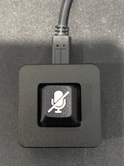
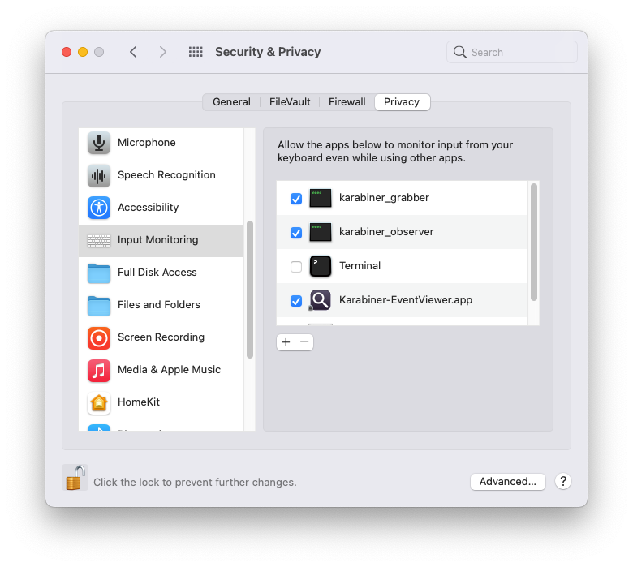
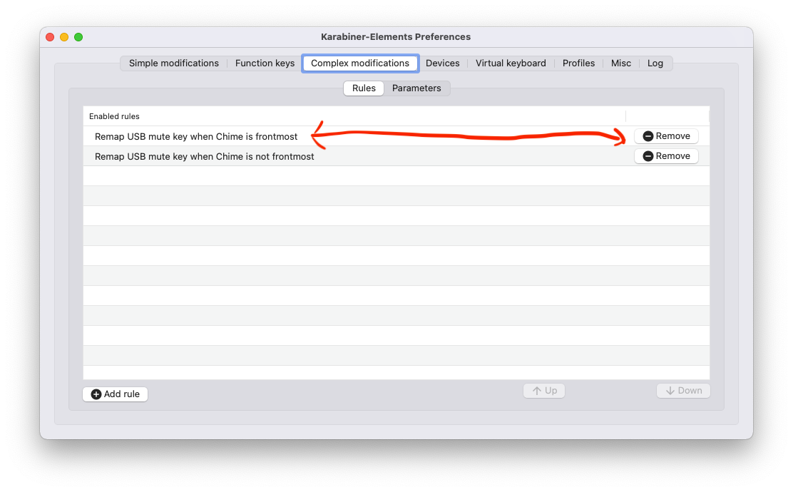
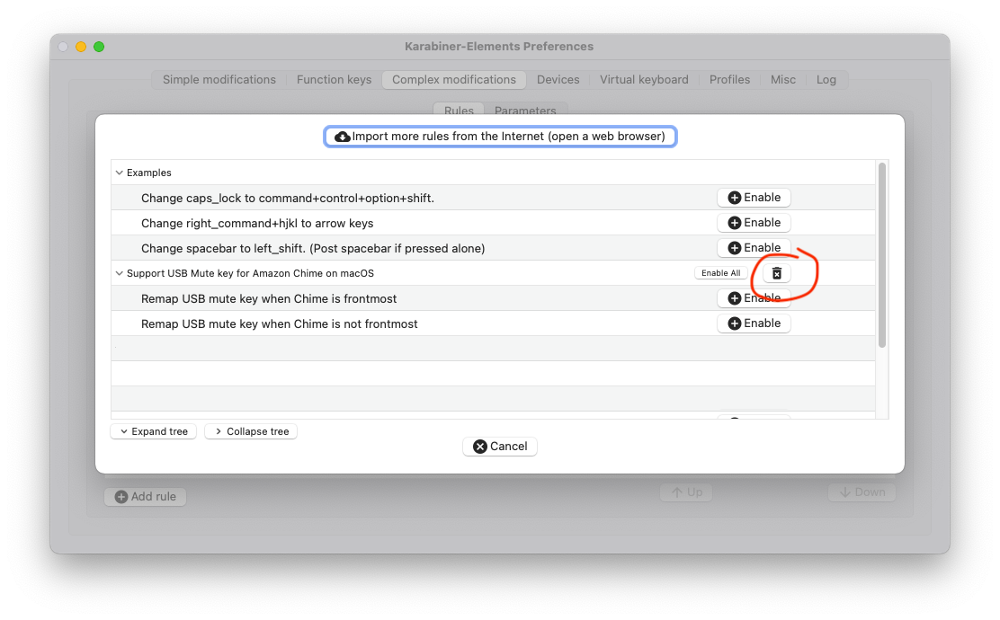
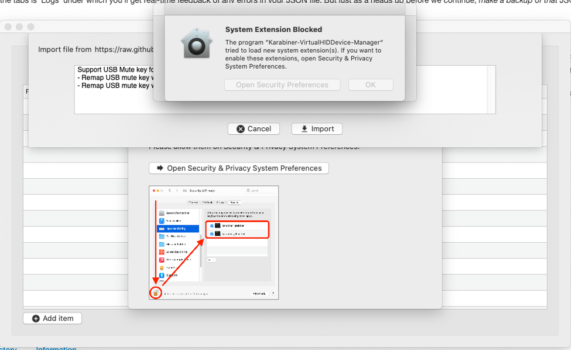
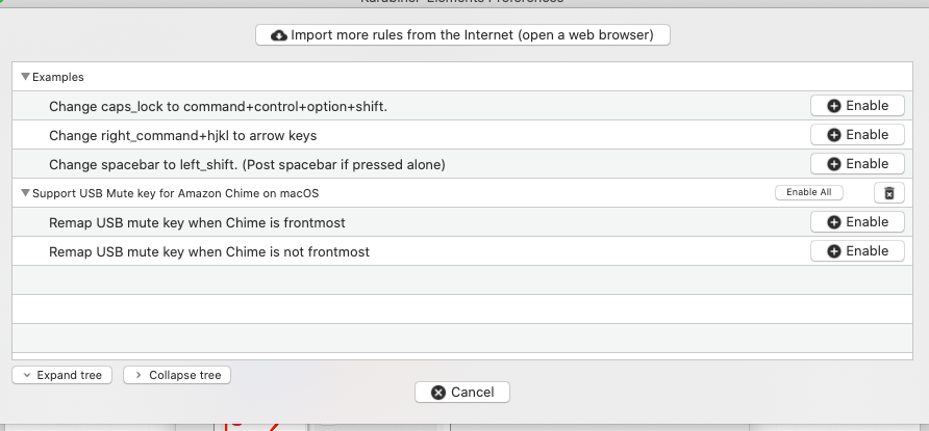
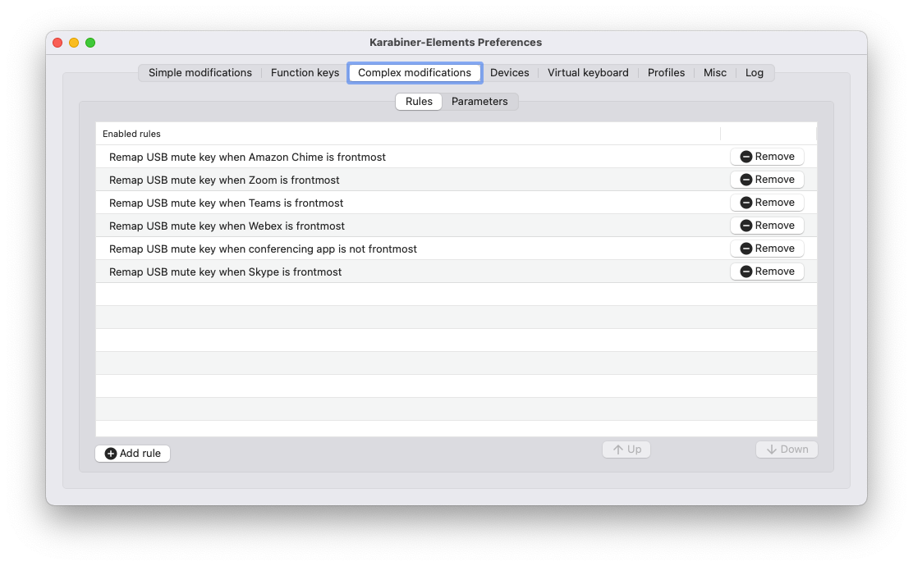

# MacMuteKey

Karabiner support for the mute keyboard device on macOS.

## TL;DR

Quick one-key for (un)muting teleconferencing apps. Unfortunately, this key can only be programmed to send one particular key sequence, so this solution makes it support multiple apps (and their different key sequences), but also detects which one you're using on-the-fly and even works when the teleconferencing app is not the frontmost app.

## A Little More Description

This solution was defined as a result of receiving a single-key mute keyboard from this manufacturer: [https://techkeys.us/collections/accessories/products/onekeyboard-mute-button-edition?variant=39598265598031](https://techkeys.us/collections/accessories/products/onekeyboard-mute-button-edition?variant=39598265598031) . The situation is that it was pre-programmed to send a Windows sequence and I needed it to send a Mac sequence. While there are simple solutions in macOS System Preferences to just swap control and command keys for a particular device, that only works for when the teleconferencing app is foreground and I wanted the key to work regardless of what application is active. As such, I leveraged Karabiner since I've been using that for years and it also allows me to use an AppleScript to support mute when your video conferencing tool is not the foreground application.

Why is this on Github? Because Karabiner is unable to process files that come from internal websites (wiki, git, etc).

For help, contact me at briberns@ or brian@dronefone.com

## Support for Teleconferencing Apps

Current support:

Application | K-E Status | AppleScript Status | Comments
----------- | ---------- | ------------------ | --------
Amazon Chime | Working | Working | May not work when someone is presenting and you 'break out' the presentation to a separate window as only one particular Chime window will accept the key sequence, and we can't tell which one from the code. Apparently this is being addressed in a future Chime release.
FaceTime | Working | Working | Requires a keyboard shortcut to be defined as FaceTime by default does not have one. See [FaceTime Support](#FaceTime-Support).
Microsoft Teams | Mostly Working | Mostly Working | Documentation says Command-Shift-M is (un)mute, but doesn't appear to have any keyboard shortcuts? Started working with Teams v1.4.00.29477?
Skype | Testing | Testing | Need to validate with an actual call.
WebEx | Working | Working |
Zoom | Working | Working | 

### If you want support for another app...

I'm happy to add support for another teleconferencing application. Either raise a github ticket or send me an email as mentioned above. I need two things:

1. The name of the application.
2. What the application appears as to the Karabiner and AppleScript.
3. What is the key sequence to (un)mute the audio.

## Keyboard Remapping 101, macOS Style

Ever use a Windows keyboard on your Mac and occasionally stumble over the placement of the Windows and Alt keys in comparison to your Mac's Option and Command keys? Sure, we can learn to live with it, but it would be nice if we could leave our muscle memory alone and just have that button immediately to the left of the spacebar behave as the Command key like it does on native Mac keyboards? That's where keyboard remapping comes in.

There is a wonderful free & open source tool available for the Mac called [Karabiner-Elements](https://karabiner-elements.pqrs.org/). With the basic installation, it doesn't really do anything other than put a skewed-square icon on your menu bar. However, from the Karabiner preferences GUI you can do things like swapping one key to behave as another or even make it that pressing (say) F1 will send a sequence of keystrokes instead. Better yet, you can also make these customizations specific to a single device allowing you to do the Alt/Command/Windows/Option key rearrangement for only that Windows USB keyboard while leaving your native Mac laptop keyboard untouched! (neat, huh?)

## Installation

### General Overview of Solution

The general overview of Karabiner and the procedure below is:

1. Installation of the Karabiner tool.
1. Visit a github page to automate the installation of two configuration rules.
1. Optionally install a small AppleScript file to support one of the rules.

There are two rules that will be installed: one which works only when Chime is the active foremost application, and another optional one which can toggle microphone mute when Chime is *not* the foremost application. The optional step 3 above is in support of that latter rule and is only necessary if you want that convenience.

##### A Little Bit About Karabiner and Configuration

The Karabiner GUI isn't quite powerful enough to define anything more advanced than a simple remapping. However, there is a JSON configuration file that exists named `${HOME}/.config/karabiner/karabiner.json` that you can freely edit to get what you want. You can edit the file with VIM, TextEdit, Emacs, etc. and the moment it is saved, Karabiner will pick it up and apply the changes. As well, in the GUI one of the tabs is 'Logs' under which you'll get real-time feedback of any errors in your JSON file. But just as a heads up, *the procedure below does not require you to edit this file*. However, if you do go tinkering with it be sure to *make a backup of that JSON file in case you want to revert!*

So let's get started!

### Install Karabiner-Elements

This is the easy part. Visit the [Karabiner-Elements website and download the .DMG file](https://karabiner-elements.pqrs.org/). This disk image contains a .PKG which you can double click to install. Note that this will probably require administrative privileges on your Mac because it installed a kernel extension (kext) which is necessary to shim itself between the keyboard and the macOS. As well, with the most recent versions of the macOS it might also cause some security dialogs to appear because it needs permission in the macOS System Preferences to control 'Accessibility' of the macOS.

**NOTE:** This is also available through Mac HomeBrew: `brew install karabiner-elements`.

As shown in the image below, you will need to permission three support apps: karabinergrabber, karabinerobserver, and Karabiner-EventViewer.app. The first two are the OS shims necessary to do the remapping, but the 3rd is only necessary if you choose to use the Event Viewer application which is a tool to discover keystrokes, mouse buttons, and USB device IDs if you want to create additional rules.

Go into System Preferences -> Security & Privacy -> (top tab) Privacy -> (left scroll) Input Monitoring and enable the 3 tools to have permission.

### Installation of Rules for the Mute Key

Now that you've installed Karabiner-Elements, you need to specify rules for it to do something useful as by default it doesn't do anything except pass all keystrokes through as expected.

When I originally put together this solution, I thought it was done-and-dusted ... until I started tinkering around with it and realized I could support additional teleconferencing apps with some tweaks. As such, you might have already installed an earlier version of the rule set and thus we come to a fork in the road:

If you are UPGRADING from an earlier version of the rules, follow along to the next section.
If you are **INSTALLING FOR THE FIRST TIME**, then skip to the section [Installing Karabiner Rules].

### Upgrading Karabiner Rules

If you have previously installed an earlier version of the rule set (e.g. v1.0), you need to remove the obsolete rules. You can do this through the Karabiner GUI (it's in your Applications folder) under 'Complex Modifications' and do two steps:

Disable and remove the previous complex rules.
Remove the artifacts of the previous complex rules.
To disable and remove the previous complex rules, open the Karabiner GUI, click on 'Complex modifications' and you should have a window like this:

While you may have more than one listed, what you're looking for is any rules that are 'Remap USB mute key when...', i.e. any of the rules this solution has defined previously. Click on the 'Remove' button to the right for each one you find.

Next, you need to remove the artifacts of the previous rules. When you first installed the mute key rules, Karabiner kept a copy so that you could re-add them without having to go back to the github page. However, since we're installing new versions we want to get rid of the old version since Karabiner doesn't provide a means for detecting or overwrite an older artifact; it treats every import as new and unique despite their similarities.

To remove the artifacts, click on the 'Add rule' button in the lower right and you'll get a window like this:

Circled in RED is the delete button for the older v1.0 rules. Click on the delete button and it will remove this rule set from the Karabiner rule artifacts storage.

Going forward, the procedure will be the same to delete older rules as the version number increases and you choose to upgrade the rule set. As well, starting with v2.0 the rule set will also include version numbers in the description to make this easier.

Once you have removed the older rules, you can import the new rules from the regular "Install rules" section of this document as if you were installing for the first time.

### Installing Karabiner Rules

Typically creating rules involves clicking through the Karabiner GUI or editing the JSON config file, but I have made the process easy by leveraging it's browser protocol support, so you can just click on the below:

[Download and Install Mute Key Rules to Karabiner (v2.0.0)](karabiner://karabiner/assets/complexmodifications/import?url=https://raw.githubusercontent.com/bernstbj/macmutekey/master/bjbmutekey.json)

What should happen now is that your browser will attempt to launch the Karabiner-Elements app and pass the custom rules JSON to it. If you have done everything right so far, a dialog will appear noting the two rules it is going to install along with an 'Import' button. Otherwise, you might get something similar to the below which is noting that you did not permission the Karabiner tools in macOS and will have to go back to the System Preferences -> Security & Privacy settings.

Otherwise, you should end up with a window like the below. You can ignore the 'Examples' settings and look at the 'Support USB Mute key' ones instead. Click on the 'Enable All' button to the right of the 'Remap USB Mute...' row. Note that depending on the version of the rule set, you may see more than the two depicted below.

At this point, you should end up with several rules in the Karabiner GUI under 'Complex Modifications' which look like the below image~:

What this is showing is that you have two rules types: "foremost" and "not foremost".

The "foremost" rules are simply stating that when Chime (or whichever app) is active and the foremost application, if it detects a Control-Y sequence from specifically the USB Mute Key device, it will translate the key sequence to the correct sequence for the target application. Straight forward key remapping, but specific to the device and application.

The "not foremost" rule is a bit more complex in that if a teleconferencing app is *not* the foremost application, it will instead launch an AppleScript file that will do a little trick to determine which teleconferencing app you're using, temporarily make it the foremost application, send the correct (un)mute key sequence, and then switch what was the foremost application back to being foremost. However, we need to install the AppleScript file for this to work.

### Installing AppleScript File to Support "Not Foremost" Rule

The rule we installed attempts to launch `/usr/bin/osascript` which is the command line AppleScript tool, and then we point it to a script contained in `${HOME}/.config/karabiner`. Since this directory is not unique to anyone's installation and would be created once Karabiner is installed, this is a good place to put the script.

[Download the AppleScript v2.0.1](https://raw.githubusercontent.com/bernstbj/macmutekey/master/sendMuteKeyToApps.scpt)

Note that your browser might just open the script and display it rather than saving it. If so, just save it to your Downloads folder, and move it to the location specified. If you're trying to find the `.config` directory with the "save file" dialog, note that the leading '.' makes it a *hidden* directory in UNIX-speak, so you can press `Command-Shift-.` to toggle visibility of hidden files and directories.

But alternatively you can do this from the command line (Terminal) by entering the command:

    mv ~/Downloads/sendMuteKeyToApps.scpt ~/.config/karabiner
    
It should not require any special permissions as it only runs in user space and does not do anything that requires administrative privileges.

### Configuring The Solution

As mentioned in the AppleScript section, there is a "foremost" and "not foremost" divide. Version 2.0 and later now support multiple teleconferencing apps. When the teleconferencing app is in the foreground, the logic is simple in that it will send the (un)mute key sequence to that app and be done with it.

However, when the teleconferencing app(s) are in the back background, we have to figure out which one we're interested in and thus I've introduced some logic around two concepts: default app and prioritization.

The Default App is the one that you or your organization uses by default, i.e. the one that you always have open. The idea is that some companies will always use a particular conferencing app for internal calls, but sometimes you might need to join a call with another app (e.g. someone at AWS will always have Chime running, but might have to periodically join a Zoom call). Since the logic of this script knows how to handle several different conferencing apps, the defaultApp setting can be used as a bit of a tie-breaker. At the moment, the valid defaults are chime, zoom, skype, teams, webex.

The Prioritize Default setting is whether or not we prioritize our default app as the recipient of (un)mute over other conference tools.

If TRUE, then if we find our default alongside other conference tools, then we will send mute sequences to the default. This is if you always want the default app to receive mute sequences regardless of what else is running.
If FALSE, we assume that other tools will get mute sequences if they are running. This is for those who always run their default app, but only run (say) Zoom when they need to and will close Zoom down when they're done, i.e. if we find a non-Chime tool running, then we assume that is the tool that needs to be (un)muted.

For the most part, an AWS employee would probably set Chime as the default and set prioritization to FALSE so that if you're on a zoom/teams/webex call, you will send the (un)mute key to those apps instead of Chime. Of course, to make this work well the assumption is that you will quit non-Chime apps when you're done with those calls because there is no way for this solution to determine if any of the teleconferencing apps are actually in a call (that would have been ideal, but alas it isn't possible...)

So to edit this, you need to open your favorite text editor and the file `~/.config/karabiner/sendMuteKeyToApps.scpt`. You will find in the first dozen or so lines where you can set the default app and prioritization. Make any necessary changes and save the file - the changes will take hold immediately.

### Testing The Solution

Now that you've done all this, try starting an instant meeting in Chime with no participants other than yourself. Check to see that the mute key (un)mutes your microphone (that would be a test of the first rule). Then, switch to another application and press the mute key again and check that Chime (un)mutes your microphone. Note that when Chime is not foremost, the response time for the (un)mute operation is slightly slower due to the invocation of the AppleScript.

If you run into any issues, please do not hesitate to contact me on Slack or via email (briberns@) - While I have been using Karabiner successfully for years and also can validate that this solution has been working for me since I created it, I cannot say that I have *installed* Karabiner much in the last few years. Please let me know and I can improve this page for others!

## FaceTime Support

By default, FaceTime does not have a keyboard shortcut to (un)mute. However, it does have a menu item and thus you can define a keyboard shortcut to make this possible.

So from a Terminal command prompt, copy-and-paste the following which will set up Command-Y as the (un)mute keyboard shortcut:

    defaults write com.apple.FaceTime NSUserKeyEquivalents '{ "\033Video\033Mute" = "@y"; }'

If you are curious where this appears, the GUI for keyboard shortcuts is System Preferences > Keyboard > Shortcuts > App Shortcuts (left window list) and then it is added to the right window list under FaceTime.app.

## Upgrading to New Release

coming soon, but for the most part you need to remove the MacMuteKey rules from Karabiner and then do the 'Installation' again. Most likely the Karabiner rules will go lockstep with the AppleScript, however, you can use the command line `what ~/.config/karabiner/sendMuteKeyToApps.scpt` to see what version it reports back and compare to what is noted as latest-and-greatest here.

As I said, work in progress....

## Frequently Asked Questions (FAQ)

#### Q: Are the rules or the AppleScript AWS specific in any way?

No. The rules are very straight-forward translations, and the AppleScript is only specific to Chime/Zoom/Teams/etc. in that it knows about the bundle identifier of (e.g.) com.amazon.Amazon-Chime. Nothing proprietary, AWS confidential, or otherwise unsharable is contained in the solution above.

#### Q: Sometimes the mute doesn't toggle when the teleconferencing app is not the foremost application - is there a way to fix this?

When the current teleconferencing app is not the foremost application, the AppleScript file is executed instead of doing a simple key translation. The nature of the script is that it figures out what the foremost application is at the time, and then attempts to activate (say) Chime and make it foremost. Once Chime is foremost, it sends the mute key sequence before switching the former application back to the front. The activation is handled by two delay loops: one which is waiting for Chime to activate, and then another a few lines further down which is a delay before sending the key sequence. In my testing, the 0.1 second delay was sufficient, however, you might resolve your situation if you increase the value to 0.5 or even 1.0 seconds. This value is configurable towards the beginning of the script as the variable `switchAppDelay`. **UPDATE 2021-10-28:** This configuration variable has been removed as the AppleScript v2.0.1 seems to have eliminated the problem while also making things faster. If you are still seeing misfires, then please let me know!

#### Q: I upgraded from v1.0 to v2.0 - do I need to remove the old AppleScript from v1.0?

No. You can if you want, but once you removed the old v1.0 Karabiner rules, you're simply no longer referencing the old AppleScript. However, you are more than welcome to remove the old chimeMuteToggle.scpt file if you like.

#### Q: Sometimes a Finder window appears when I press the mute key?

This happens when the Finder is the active application at the time that you press the mute key and there were no open Finder windows. The situation is that since the teleconferencing app was nore foremost at the time, so the AppleScript switches over to the teleconferencing app to (un)mute, then switches back to the Finder to reactivate it as the foremost active application. However, what happens is that when Finder is told to reactivate by the AppleScript code, Finder decides that there must be at least one Finder window open to do this and thus it opens whatever window it can or creates a new one. Unfortunately, there doesn't seem to be a way to re-activate Finder without it doing this.

#### Q: Do you want feedback or suggestions for other applications to support?

Yes! Please contact me or comment on this wiki page.

## Version History

### v1.0.0 - Sep 2021

Initial release. Only supports Amazon Chime in foreground and background modes.

### v2.0.0 - Oct 2021

Major rework to support other teleconferencing applications: Amazon Chime, Zoom, Microsoft Teams, Microsoft Skype, and WebEx.
Reworked some of the naming of things to make it more generic since it isn't limited to Amazon Chime anymore.

### v2.0.1 - 2021-10-28

Slight tweak to the AppleScript that is used when the teleconferencing app is not foremost to make it (un)mute faster. As a result, got to remove the configuration item for delay.

### v2.1.0 - 2021-11-18

Added support for FaceTime, though it requires a keyboard shortcut to be defined for it to work. As well, fixed support for WebEx - now it appears to be working correctly.

